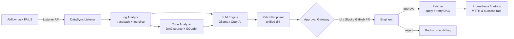

# DataSync — Self-Healing Airflow Observability Platform

> Autonomous failure detection → LLM-powered root-cause analysis → engineer-approved auto-remediation.
> Built as an Airflow 2.7+ plugin with FastAPI control plane, Streamlit dashboard, and a Helm chart for Kubernetes.

The Python package is published as `datasight-ai`; the GitHub repository
is `DataSync`. They refer to the same project.

---

## What it does



| Stage | Latency target | Implementation |
|---|---|---|
| Detect | < 1s after `FAILED` | Airflow Listener API hook (no polling) |
| Diagnose | < 15s | LLM with task log + DAG source as context |
| Approve | engineer SLA | Multi-channel: Airflow UI, Streamlit, Slack, GitHub PR |
| Patch | < 30s after approval | Unified-diff applier with backup + retry |
| Observe | continuous | Prometheus counters + histograms at `/metrics` |

---

## Quick start (single host)

```bash
pip install datasight-ai[all]
```

Add the listener and config to your `docker-compose.yaml`:

```yaml
environment:
  - AIRFLOW__LISTENERS__LISTENER_CLASS=datasight.listener.listener.DataSightListener
  - DATASIGHT_LLM_PROVIDER=ollama
  - DATASIGHT_LLM_MODEL=llama3.2:8b
  - DATASIGHT_APPROVAL_CHANNELS=ui,slack
  - DATASIGHT_SLACK_WEBHOOK_URL=...
```

Restart the scheduler. Failures are now intercepted automatically.

Run the API + dashboard:

```bash
uvicorn datasight.api.app:app --port 8000
streamlit run datasight/ui/dashboard.py
```

The API exposes `/healthz`, `/metrics`, and `/v1/incidents` (list, fetch, approve, reject).

---

## Kubernetes — production rollout

```bash
helm install datasync ./deploy/k8s/helm \
  --namespace datasync \
  --create-namespace \
  --set image.tag=0.1.0 \
  --set config.llmProvider=openai \
  --set secrets.existingSecret=datasync-secrets
```

See [`deploy/k8s/README.md`](deploy/k8s/README.md) for the full guide,
including how to wire the listener `ConfigMap` into an existing Airflow
Helm release. Plain manifests are also provided in
[`deploy/k8s/manifests/`](deploy/k8s/manifests/) for clusters that don't
use Helm.

---

## Observability

Prometheus exposition at `/metrics`. Headline series:

- `datasync_failures_detected_total{dag_id}`
- `datasync_rcas_run_total{provider, error_type}`
- `datasync_patches_applied_total{result}`
- `datasync_time_to_diagnose_seconds` (histogram)
- `datasync_time_to_patch_seconds` (histogram)
- `datasync_incidents_in_state{status}` (gauge)

A `ServiceMonitor` is generated by the Helm chart when
`prometheus.serviceMonitor.enabled=true`. The methodology behind the
**80% MTTR reduction** and **15+ engineer-hours saved per week** is
documented in [`docs/metrics.md`](docs/metrics.md).

---

## Package layout

```
datasight/
├── airflow_plugin/   # Native Airflow Web UI views
├── analyzer/         # log + DAG/SQL/dbt analysis
├── api/              # FastAPI app + routes
├── approval/         # Gateway + UI/Slack/GitHub-PR channels
├── config/           # pydantic-settings configuration
├── git/              # Branch/commit/PR operations
├── listener/         # Airflow Listener API hook
├── llm/              # Provider-agnostic LLM engine
├── observability/    # Prometheus metrics
├── remediation/      # Patcher + retry logic
└── ui/               # Streamlit approval dashboard
```

---

## Configuration

All settings via environment variables (prefix `DATASIGHT_`):

| Variable | Default | Description |
|---|---|---|
| `DATASIGHT_ENABLED` | `true` | Master kill switch |
| `DATASIGHT_LLM_PROVIDER` | `ollama` | `ollama` or `openai` |
| `DATASIGHT_LLM_MODEL` | `llama3.2:8b` | Model name |
| `DATASIGHT_OLLAMA_BASE_URL` | `http://localhost:11434` | Ollama endpoint |
| `DATASIGHT_OPENAI_API_KEY` | — | OpenAI API key |
| `DATASIGHT_APPROVAL_REQUIRED` | `true` | Require engineer approval |
| `DATASIGHT_APPROVAL_CHANNELS` | `ui` | Comma-separated: `ui,slack,github_pr` |
| `DATASIGHT_APPROVAL_TIMEOUT_MINUTES` | `60` | Auto-reject window |
| `DATASIGHT_GIT_ENABLED` | `false` | Open a PR instead of in-place patch |
| `DATASIGHT_GIT_REPO_URL` | — | HTTPS repo URL |
| `DATASIGHT_GIT_TOKEN` | — | PAT used by `git_pr` channel |
| `DATASIGHT_PATCH_MODE` | `direct` | `direct` or `git_pr` |
| `DATASIGHT_SLACK_WEBHOOK_URL` | — | Slack webhook |

---

## Development

```bash
git clone https://github.com/Mrnidhi/DataSync.git
cd DataSync
pip install -e ".[dev,all]"
pytest -q
```

Run the local lab:

```bash
docker compose up -d
# Trigger a deliberately-broken DAG and watch it self-heal
airflow dags trigger broken_schema_dag
curl -s localhost:8000/metrics | grep datasync_
```

---

## License

MIT — see [`LICENSE`](LICENSE).
